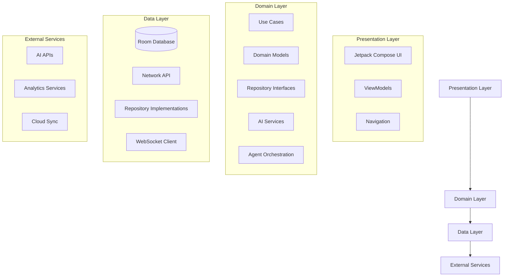
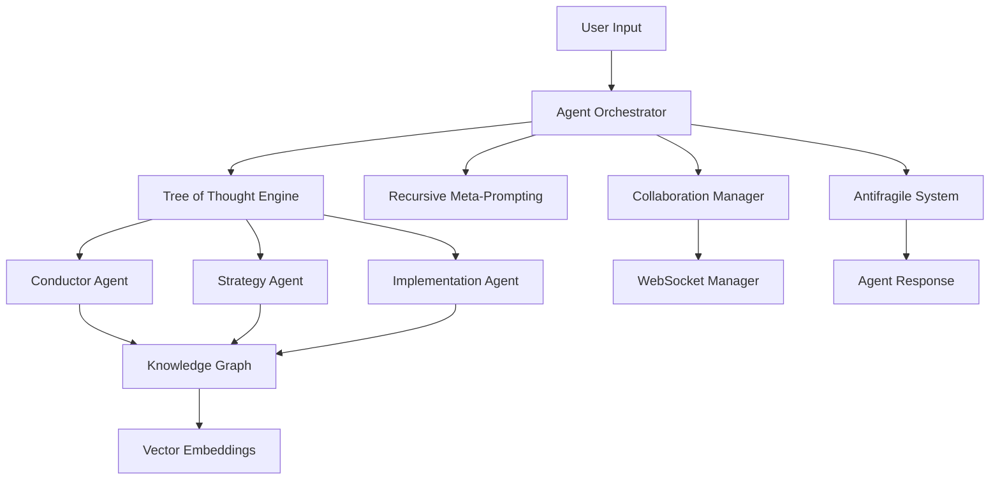

# SynthNet AI - Architecture Documentation

## 🏛️ System Architecture Overview

SynthNet AI implements a sophisticated multi-layered architecture designed for scalability, maintainability, and advanced AI capabilities. The system follows Clean Architecture principles with domain-driven design patterns.

## 📋 Table of Contents

- [High-Level Architecture](#high-level-architecture)
- [Layer Details](#layer-details)
- [AI System Design](#ai-system-design)
- [Data Flow](#data-flow)
- [Component Interactions](#component-interactions)
- [Scalability Considerations](#scalability-considerations)
- [Security Architecture](#security-architecture)
- [Performance Patterns](#performance-patterns)

## 🎯 High-Level Architecture



## 📚 Layer Details

### Presentation Layer

#### Jetpack Compose UI
- **Modern declarative UI**: Reactive UI that rebuilds when state changes
- **Component-based**: Reusable UI components with clear separation of concerns
- **Animation support**: Rich animations for enhanced user experience
- **Theme system**: Dynamic theming with Material 3 design

```kotlin
@Composable
fun ProjectScreen(
    viewModel: ProjectViewModel = hiltViewModel()
) {
    val uiState by viewModel.uiState.collectAsStateWithLifecycle()
    
    // UI implementation with state management
}
```

#### ViewModels (MVVM Pattern)
- **State management**: Centralized UI state handling
- **Lifecycle awareness**: Automatic cleanup and resource management
- **Coroutine integration**: Structured concurrency for async operations
- **Error handling**: Consistent error state management

```kotlin
@HiltViewModel
class ProjectDetailViewModel @Inject constructor(
    private val orchestrator: AgentOrchestrator,
    private val repository: ProjectRepository
) : ViewModel() {
    // ViewModel implementation
}
```

### Domain Layer

#### Use Cases
- **Single responsibility**: Each use case handles one specific business operation
- **Testable**: Pure business logic without framework dependencies
- **Composable**: Use cases can be combined for complex operations

```kotlin
class ProcessUserInputUseCase @Inject constructor(
    private val orchestrator: AgentOrchestrator
) {
    suspend operator fun invoke(
        projectId: String,
        input: String,
        context: ProjectContext
    ): Result<AgentResponse> = orchestrator.processUserInput(projectId, input, context)
}
```

#### Domain Models
- **Rich domain objects**: Models with behavior, not just data
- **Value objects**: Immutable objects representing domain concepts
- **Aggregates**: Consistency boundaries for related objects

#### Repository Interfaces
- **Abstraction layer**: Hide data source implementation details
- **Contract definition**: Clear API for data operations
- **Testability**: Enable easy mocking for unit tests

### Data Layer

#### Room Database
- **Local persistence**: Offline-first data storage
- **Type safety**: Compile-time SQL validation
- **Reactive queries**: Flow-based data observation
- **Migration support**: Schema evolution handling

```kotlin
@Entity(tableName = "projects")
data class ProjectEntity(
    @PrimaryKey val id: String,
    val name: String,
    val description: String,
    // ... other properties
)
```

#### Repository Implementations
- **Data source coordination**: Combine local and remote data
- **Caching strategies**: Intelligent data caching
- **Sync management**: Offline/online data synchronization

## 🤖 AI System Design

### Agent Orchestration Architecture



### Tree of Thought (ToT) Implementation

The ToT engine implements a multi-step reasoning process:

1. **Thought Generation**: Multiple agents generate initial thoughts
2. **Branch Expansion**: Each thought spawns multiple alternative paths
3. **Evaluation**: Thoughts are scored based on confidence and relevance
4. **Selection**: Best paths are chosen for further exploration
5. **Synthesis**: Final response combines insights from selected paths

```kotlin
suspend fun executeToTWorkflow(
    projectId: String,
    prompt: String,
    agents: List<Agent>,
    context: ProjectContext
): ThoughtTree {
    val initialThoughts = generateInitialThoughts(projectId, prompt, agents, context)
    val expandedThoughts = expandThoughts(initialThoughts, agents, context)
    val evaluatedBranches = evaluateThoughtBranches(expandedThoughts)
    val selectedPaths = selectPromisingPaths(evaluatedBranches)
    return buildThoughtTree(projectId, initialThoughts, evaluatedBranches, selectedPaths)
}
```

### Recursive Meta-Prompting (RMP) System

RMP provides continuous response optimization:

1. **Analysis**: Evaluate current response quality
2. **Improvement Identification**: Find areas for enhancement
3. **Optimization**: Apply improvements iteratively
4. **Validation**: Verify improved response quality

### Knowledge Graph Integration

The knowledge graph system provides semantic understanding:

- **Entity Recognition**: Identify key concepts and relationships
- **Semantic Search**: Find related information using vector embeddings
- **Inference**: Discover new relationships through reasoning
- **Evolution**: Graph grows and adapts over time

## 🔄 Data Flow

### Primary Data Flow Patterns

1. **User Interaction Flow**
   ```
   User Input → ViewModel → Use Case → Repository → Database/API
   ```

2. **AI Processing Flow**
   ```
   Input → Orchestrator → ToT Engine → Agents → Knowledge Graph → Response
   ```

3. **Real-time Collaboration Flow**
   ```
   Agent Action → WebSocket → Collaboration Manager → Other Agents → UI Update
   ```

4. **Analytics Flow**
   ```
   Events → Analytics Engine → Time Series DB → Insights → Dashboard
   ```

### State Management

#### Reactive State Flow
- **StateFlow**: UI state management with automatic updates
- **Flow transformations**: Data processing pipelines
- **Combine operators**: Multi-source state aggregation

```kotlin
val uiState = combine(
    projectFlow,
    agentsFlow,
    collaborationsFlow
) { project, agents, collaborations ->
    ProjectDetailUiState(
        project = project,
        agents = agents,
        collaborations = collaborations
    )
}.stateIn(viewModelScope, SharingStarted.Lazily, ProjectDetailUiState())
```

## 🔗 Component Interactions

### Dependency Injection (Hilt)

The system uses Hilt for dependency injection with clear module organization:

```kotlin
@Module
@InstallIn(SingletonComponent::class)
object AIModule {
    @Provides
    @Singleton
    fun provideAgentOrchestrator(
        agentRepository: AgentRepository,
        thoughtRepository: ThoughtRepository,
        totEngine: TreeOfThoughtEngine,
        rmpEngine: RecursiveMetaPrompting,
        collaborationManager: CollaborationManager,
        antifragileSystem: AntifragileSystem
    ): AgentOrchestrator = AgentOrchestrator(...)
}
```

### Service Communication

#### Synchronous Communication
- **Direct method calls**: For immediate responses
- **Use case pattern**: Structured business logic execution
- **Result types**: Explicit success/failure handling

#### Asynchronous Communication
- **Coroutines**: Structured concurrency
- **Channels**: Agent-to-agent communication
- **WebSockets**: Real-time collaboration
- **Events**: Decoupled component communication

### Error Handling Strategy

#### Antifragile Error Recovery

The system implements multiple levels of error recovery:

1. **Primary Operation**: Normal execution path
2. **Retry Logic**: Automatic retry with exponential backoff
3. **Degraded Mode**: Reduced functionality fallback
4. **Cached Response**: Use previous valid response
5. **Default Response**: Safe fallback response
6. **Human Escalation**: Alert user for manual intervention

```kotlin
suspend fun <T> executeWithFallback(
    operationName: String,
    operation: suspend () -> Result<T>
): Result<T> {
    val fallbackChain = getFallbackChain(operationName)
    
    for (fallback in fallbackChain) {
        try {
            return when (fallback.type) {
                FallbackType.PRIMARY -> operation()
                FallbackType.RETRY -> retryWithDelay(operation, fallback.delayMs)
                FallbackType.DEGRADED -> executeWithDegradedMode(operation)
                FallbackType.CACHED -> getCachedResult(operationName)
                FallbackType.DEFAULT -> getDefaultResult(operationName)
                FallbackType.HUMAN_ESCALATION -> escalateToHuman(operationName)
            }
        } catch (e: Exception) {
            // Continue to next fallback
        }
    }
    
    return Result.failure(Exception("All fallbacks exhausted"))
}
```

## 📈 Scalability Considerations

### Performance Optimization

#### Memory Management
- **Lazy initialization**: Load resources only when needed
- **Object pooling**: Reuse expensive objects
- **Weak references**: Prevent memory leaks
- **Garbage collection optimization**: Minimize allocation pressure

#### Processing Optimization
- **Parallel processing**: Utilize multiple cores
- **Caching strategies**: Multi-level caching
- **Database optimization**: Efficient queries and indexing
- **Network optimization**: Request batching and compression

### Horizontal Scaling

#### Agent Scalability
- **Agent pooling**: Dynamic agent allocation
- **Load balancing**: Distribute work across agents
- **Resource monitoring**: Prevent resource exhaustion
- **Graceful degradation**: Maintain functionality under load

#### Data Scalability
- **Sharding strategies**: Distribute data across partitions
- **Read replicas**: Scale read operations
- **Caching layers**: Reduce database load
- **Async processing**: Handle large operations asynchronously

## 🔐 Security Architecture

### Data Security

#### Encryption
- **Data at rest**: Local database encryption
- **Data in transit**: TLS for all network communication
- **Key management**: Secure key storage and rotation
- **Sensitive data**: Additional encryption for PII

#### Access Control
- **Authentication**: User identity verification
- **Authorization**: Permission-based access control
- **Session management**: Secure session handling
- **API security**: Rate limiting and validation

### AI Security

#### Model Safety
- **Confidence thresholds**: Require high confidence for autonomous actions
- **Human oversight**: Escalation mechanisms for critical decisions
- **Audit trails**: Complete logging of AI decisions
- **Bias detection**: Monitor for unfair or biased outputs

#### Privacy Protection
- **Data minimization**: Collect only necessary data
- **Anonymization**: Remove PII where possible
- **Consent management**: Explicit user consent
- **Right to deletion**: Data removal capabilities

## ⚡ Performance Patterns

### Reactive Programming

#### Flow-based Architecture
- **Data streams**: Reactive data flow throughout the system
- **Backpressure handling**: Manage flow control under load
- **Error propagation**: Graceful error handling in streams
- **Resource cleanup**: Automatic subscription management

### Caching Strategies

#### Multi-level Caching
1. **Memory cache**: Fast in-memory object cache
2. **Disk cache**: Persistent local storage
3. **Database cache**: Query result caching
4. **Network cache**: HTTP response caching

#### Cache Invalidation
- **Time-based**: Automatic expiration
- **Event-based**: Invalidate on data changes
- **LRU eviction**: Remove least recently used items
- **Smart prefetching**: Anticipate future requests

### Background Processing

#### Service Architecture
- **Foreground services**: Long-running operations
- **Work manager**: Scheduled and deferred tasks
- **JobIntentService**: Reliable background processing
- **Notification integration**: Progress and status updates

```kotlin
@AndroidEntryPoint
class AIBackgroundService : Service() {
    
    private val serviceScope = CoroutineScope(Dispatchers.IO + SupervisorJob())
    
    override fun onStartCommand(intent: Intent?, flags: Int, startId: Int): Int {
        when (intent?.action) {
            ACTION_START_MONITORING -> startMonitoring()
            ACTION_PROCESS_TASKS -> processBackgroundTasks()
        }
        return START_STICKY
    }
    
    private fun startMonitoring() {
        serviceScope.launch {
            launch { healthMonitoring() }
            launch { metricsCollection() }
            launch { autoOptimization() }
        }
    }
}
```

## 🔧 Configuration Management

### Environment Configuration
- **Build variants**: Debug, staging, production configs
- **Feature flags**: Runtime feature toggles
- **API endpoints**: Environment-specific URLs
- **Analytics settings**: Configurable tracking levels

### AI Model Configuration
- **Model parameters**: Adjustable AI behavior
- **Threshold settings**: Confidence and quality thresholds
- **Fallback configurations**: Error recovery settings
- **Learning rates**: Adaptive learning parameters

---

This architecture provides a solid foundation for building sophisticated AI-powered applications while maintaining code quality, performance, and scalability. The modular design allows for easy testing, maintenance, and future enhancements.