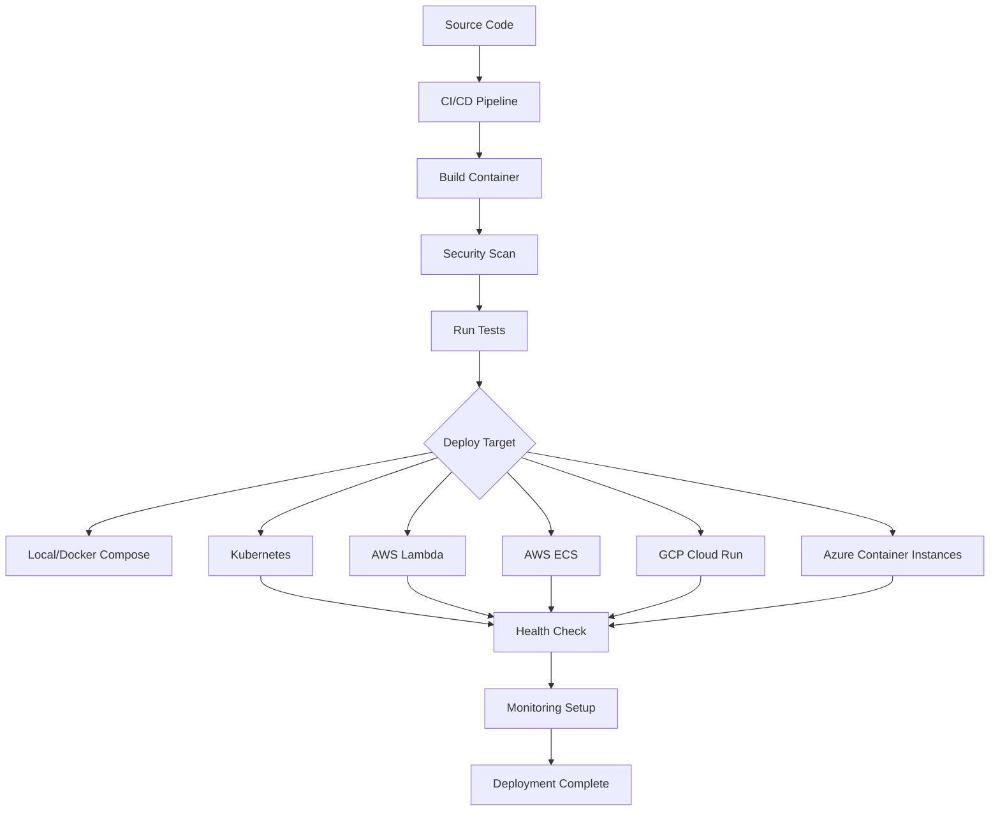

# MCP Server Deployment System - Complete Guide

## Overview

The MCP Server Deployment System is a comprehensive, production-ready deployment infrastructure for Model Context Protocol servers. It provides seamless deployment across multiple environments with enterprise-grade reliability, security, and observability.

## Table of Contents

1. [Quick Start](#quick-start)
2. [Architecture Overview](#architecture-overview)
3. [Deployment Targets](#deployment-targets)
4. [Configuration Management](#configuration-management)
5. [Security Features](#security-features)
6. [Monitoring & Observability](#monitoring--observability)
7. [CI/CD Integration](#cicd-integration)
8. [Specialized Deployments](#specialized-deployments)
9. [Troubleshooting](#troubleshooting)
10. [Best Practices](#best-practices)

## Quick Start

### Prerequisites

```bash
# Install required tools
kubectl --version
docker --version
helm version
aws --version  # For AWS deployments
```

### 1. Local Development Deployment

```bash
# Clone the deployment system
git clone <repository-url>
cd mcp-server-deployment-system

# Deploy locally with Docker Compose
./scripts/deploy.sh --environment development --target local

# Check deployment status
docker-compose -f containers/docker-compose.yml ps
```

### 2. Kubernetes Staging Deployment

```bash
# Configure kubectl context
kubectl config use-context staging-cluster

# Deploy to Kubernetes staging
./scripts/deploy.sh \
  --environment staging \
  --target kubernetes \
  --namespace mcp-server-staging \
  --image mcp-server:v1.0.0

# Monitor deployment
kubectl get pods -n mcp-server-staging -w
```

### 3. Production AWS Lambda Deployment

```bash
# Configure AWS credentials
aws configure

# Deploy to AWS Lambda
./scripts/deploy.sh \
  --environment production \
  --target aws-lambda \
  --image mcp-server:v1.0.0
```

## Architecture Overview

### Core Components

```
mcp-server-deployment-system/
├── containers/              # Docker configurations
│   ├── Dockerfile.production    # Multi-stage production build
│   ├── Dockerfile.development   # Development build
│   └── docker-compose.yml       # Local development stack
├── kubernetes/             # Kubernetes manifests
│   ├── base/                   # Base configurations
│   ├── overlays/              # Environment-specific overlays
│   └── helm-charts/           # Helm charts
├── cloud/                  # Cloud-specific deployments
│   ├── aws/                   # AWS Lambda, ECS, EKS
│   ├── gcp/                   # Google Cloud Run, GKE
│   └── azure/                 # Azure Container Instances, AKS
├── ci-cd/                  # CI/CD pipeline templates
│   ├── github-actions/        # GitHub Actions workflows
│   ├── gitlab-ci/            # GitLab CI configurations
│   └── jenkins/              # Jenkins pipelines
├── monitoring/             # Observability configurations
│   ├── prometheus/           # Metrics collection
│   ├── grafana/             # Visualization dashboards
│   └── logging/             # Log aggregation
├── scripts/                # Deployment automation
│   ├── deploy.sh            # Universal deployment script
│   ├── rollback.sh          # Rollback automation
│   └── health-check.sh      # Health verification
├── config/                 # Configuration templates
├── examples/               # Specialized deployment examples
└── docs/                   # Documentation
```

### Deployment Flow



## Deployment Targets

### 1. Local Development

**Use Case**: Development, testing, debugging
**Technology**: Docker Compose
**Command**: `./scripts/deploy.sh --target local`

**Features**:
- Hot reloading
- Debug ports exposed
- Development tools included
- Local databases and services

### 2. Kubernetes

**Use Case**: Production, staging, scalable deployments
**Technology**: Kubernetes with Helm charts
**Command**: `./scripts/deploy.sh --target kubernetes`

**Features**:
- Auto-scaling (HPA/VPA)
- Rolling updates
- Health checks
- Service mesh integration
- Persistent storage
- Network policies

### 3. AWS Lambda

**Use Case**: Serverless, cost-optimized, auto-scaling
**Technology**: AWS Lambda with Serverless Framework
**Command**: `./scripts/deploy.sh --target aws-lambda`

**Features**:
- Serverless architecture
- Auto-scaling to zero
- Pay-per-request pricing
- API Gateway integration
- CloudWatch monitoring

### 4. AWS ECS Fargate

**Use Case**: Container orchestration without Kubernetes
**Technology**: AWS ECS with Fargate
**Command**: `./scripts/deploy.sh --target aws-ecs`

**Features**:
- Managed container platform
- No server management
- Application Load Balancer
- Service discovery
- Auto-scaling

### 5. Google Cloud Run

**Use Case**: Serverless containers on GCP
**Technology**: Google Cloud Run
**Command**: `./scripts/deploy.sh --target gcp-cloud-run`

**Features**:
- Fully managed serverless
- Request-based billing
- Global load balancing
- Custom domains
- Traffic splitting

### 6. Azure Container Instances

**Use Case**: Simple container deployment on Azure
**Technology**: Azure Container Instances
**Command**: `./scripts/deploy.sh --target azure-container-instances`

**Features**:
- Fast container startup
- Per-second billing
- Virtual network integration
- Persistent storage
- GPU support

## Configuration Management

### Layered Configuration

1. **Base Configuration**: Common settings for all environments
2. **Environment Overlays**: Environment-specific overrides
3. **Server-Specific**: Per-server customizations
4. **Secrets Management**: Secure credential handling

### Configuration Files

```yaml
# config/base.yml
server:
  name: mcp-server
  port: 8000
  replicas: 2

resources:
  requests:
    cpu: 100m
    memory: 256Mi
  limits:
    cpu: 500m
    memory: 512Mi

monitoring:
  enabled: true
  metrics_port: 9090
  health_check_path: /health

# config/environments/production.yml
server:
  replicas: 5

resources:
  requests:
    cpu: 500m
    memory: 1Gi
  limits:
    cpu: 2000m
    memory: 4Gi

security:
  tls_enabled: true
  authentication_required: true
```

### Environment Variables

```bash
# Required environment variables
export ENVIRONMENT=production
export TARGET=kubernetes
export IMAGE_TAG=v1.0.0
export NAMESPACE=mcp-server-prod

# Optional configuration
export CONFIG_FILE=config/production.yml
export DRY_RUN=false
export VERBOSE=true
```

## Security Features

### Container Security

- **Non-root execution**: All containers run as non-root users
- **Read-only filesystems**: Minimal attack surface
- **Security scanning**: Trivy and Bandit integration
- **Distroless images**: Minimal base images
- **Secrets management**: Kubernetes secrets and cloud secret stores

### Network Security

- **Network policies**: Kubernetes network isolation
- **TLS encryption**: End-to-end encryption
- **Private networking**: VPC and subnet isolation
- **Firewall rules**: Ingress/egress traffic control

### Authentication & Authorization

- **RBAC**: Kubernetes role-based access control
- **Service accounts**: Minimal privilege principle
- **API authentication**: Token-based authentication
- **Certificate management**: Automated TLS certificate rotation

## Monitoring & Observability

### Metrics Collection

**Prometheus Configuration**:
- Application metrics
- Infrastructure metrics
- Custom business metrics
- SLA/SLI monitoring

### Visualization

**Grafana Dashboards**:
- Service health overview
- Request/response metrics
- Error rates and latency
- Resource utilization
- Cost optimization metrics

### Logging

**Centralized Logging**:
- Structured JSON logs
- Log aggregation
- Search and filtering
- Alert correlation

### Tracing

**Distributed Tracing**:
- Request flow tracking
- Performance bottlenecks
- Dependency mapping
- Error attribution

### Alerting

**Alert Manager**:
- SLA violation alerts
- Resource exhaustion warnings
- Error rate thresholds
- Custom business alerts

## CI/CD Integration

### GitHub Actions

```yaml
# .github/workflows/deploy.yml
- name: Deploy to Production
  run: |
    ./scripts/deploy.sh \
      --environment production \
      --target kubernetes \
      --image ${{ needs.build.outputs.image-tag }}
```

### GitLab CI

```yaml
# .gitlab-ci.yml
deploy:production:
  stage: deploy
  script:
    - ./scripts/deploy.sh --environment production --target kubernetes
```

### Jenkins Pipeline

```groovy
// Jenkinsfile
stage('Deploy') {
    steps {
        sh './scripts/deploy.sh --environment production --target kubernetes'
    }
}
```

## Specialized Deployments

### Healthcare FHIR Server

**Compliance Features**:
- HIPAA compliance
- Audit logging
- PHI encryption
- Multi-region deployment
- High availability

**Deployment**:
```bash
kubectl apply -f examples/healthcare/production-deployment.yaml
```

### Education LMS Server

**Scaling Features**:
- Academic calendar awareness
- Enrollment period auto-scaling
- Cost optimization
- Multi-tenant support

**Deployment**:
```bash
kubectl apply -f examples/education/scalable-deployment.yaml
```

### IoT Device Server

**Edge Computing Features**:
- Real-time processing
- Multi-protocol support
- Offline operation
- Local ML inference

**Deployment**:
```bash
kubectl apply -f examples/iot/edge-deployment.yaml
```

## Troubleshooting

### Common Issues

#### Deployment Failures

```bash
# Check deployment status
kubectl get deployments -n mcp-server-prod

# Check pod logs
kubectl logs -f deployment/mcp-server -n mcp-server-prod

# Check events
kubectl get events -n mcp-server-prod --sort-by=.metadata.creationTimestamp
```

#### Health Check Failures

```bash
# Test health endpoint directly
kubectl port-forward service/mcp-server 8080:8001 -n mcp-server-prod
curl http://localhost:8080/health

# Check resource constraints
kubectl top pods -n mcp-server-prod
```

#### Performance Issues

```bash
# Check HPA status
kubectl get hpa -n mcp-server-prod

# Review metrics in Grafana
# Navigate to dashboard: MCP Server Monitoring
```

### Debug Mode

```bash
# Enable debug logging
./scripts/deploy.sh --verbose --dry-run --target kubernetes

# Check configuration
kubectl describe configmap mcp-server-config -n mcp-server-prod
```

## Best Practices

### Development

1. **Use local development environment** for rapid iteration
2. **Implement comprehensive health checks** for all services
3. **Follow 12-factor app principles** for configuration
4. **Use semantic versioning** for image tags

### Staging

1. **Mirror production configuration** as closely as possible
2. **Run integration tests** before production deployment
3. **Test rollback procedures** regularly
4. **Validate monitoring and alerting**

### Production

1. **Use blue/green deployments** for zero downtime
2. **Monitor SLA/SLI metrics** continuously
3. **Implement proper backup strategies**
4. **Regular security updates and patching**

### Security

1. **Regular vulnerability scanning** of container images
2. **Implement least privilege access** for all components
3. **Use secrets management** for sensitive data
4. **Enable audit logging** for compliance requirements

### Cost Optimization

1. **Use auto-scaling** to match resource usage to demand
2. **Implement resource quotas** to prevent resource sprawl
3. **Monitor cost metrics** and set up alerts
4. **Use spot instances** where appropriate

### Monitoring

1. **Implement comprehensive observability** (metrics, logs, traces)
2. **Set up meaningful alerts** based on SLI/SLO
3. **Create runbooks** for common issues
4. **Regular monitoring system health checks**

## Support and Maintenance

### Regular Tasks

- **Update container images** with security patches
- **Review and update configurations** based on changing requirements
- **Monitor resource usage** and optimize as needed
- **Test disaster recovery procedures** regularly

### Documentation Maintenance

- Keep deployment guides up to date
- Update runbooks based on incidents
- Document configuration changes
- Maintain architecture diagrams

For additional support, please refer to the troubleshooting section or check the project's issue tracker.